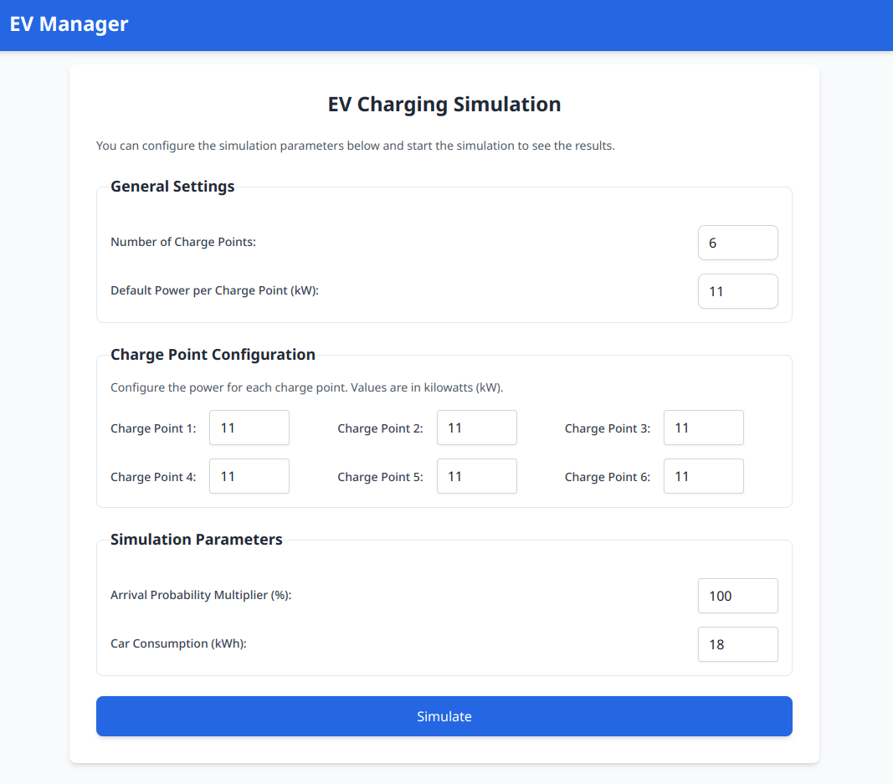

# EV Manager

A simple web application to simulate and manage electric vehicle (EV) charging stations.

---

## **Table of Contents**
- [Overview](#overview)
- [Features](#features)
- [Screenshots](#screenshots)
- [Usage](#usage)
- [Future Improvements](#future-improvements)
- [Technologies Used](#technologies-used)
- [Installation](#installation)
- [Project Structure](#project-structure)
- [Contributing](#contributing)
- [License](#license)


---

## **Overview**

Imagine you're a shopowner and you have a number of parking spaces (e.g. 200) available in front of your store for shoppers & employees. Now, because you see more and more EVs parking there every day, you're planning on building some chargepoints.
If you build 20 charging stations with a maximum charging speed of 11kW each, the theoretical maximum of total power demand is 220kW (a very high number that would be expensive to satisfy, e.g. requiring a new, more powerful grid connection). You know this is only a theoretical figure, because its statistically unlikely for all 20 charging stations to be charging at full power at the same time.
By simulating how electric chargers are actually used we can simulate how high the total energy consumption (kWh) is, what peak power loads (kW) occur, and how these figures change with the number of chargepoints installed.

This is where EV Manager comes in. It's a lightweight simulation tool that helps you calculate the total energy consumption of EV charging stations, analyze peak loads and daily charging events, and manage charging points efficiently.

- Calculate the total energy consumption of EV charging stations.
- Analyze peak loads and daily charging events.
- Manage charging points efficiently.

---

## **Features**
The application includes the following features:

- **Dynamic Input Form:** Add customizable parameters for charging stations.
- **Simulation Output:** Displays results like total energy consumption, peak load, and charging point usage.
- **Responsive Design:** Works seamlessly across devices.

## **Screenshots**

### Home Page


Coming Soon...

---

## **Usage**
### **Input Parameters**
1. Enter the following values in the input form:
    - `Charge Points`: Number of available charging points.
    - `Arrival Probability (%)`: Probability of EVs arriving at the station.
    - `Car Consumption (kWh)`: Average energy consumption of cars.
    - `Charging Power (kW)`: Maximum power of the charging stations.

2. Click the **Simulate** button to calculate results.

### **Output Results**
- **Total Energy Consumption:** Total energy consumed by all EVs.
- **Peak Load:** Maximum energy usage at peak times.
- **Daily Charging Events:** Number of events per day.
- **Charge Point Usage:** Power usage at each charging point.

---

## **Future Improvements**
Here are some ideas for improving the project:
- Add a **dark mode** feature.
- Integrate a **database** to store simulation results.
- Add **graphs and charts** to visualize data.
- Add **multi-language support** for broader accessibility.

---

## **Technologies Used**
The project is built using the following technologies:

- **React 19**: JavaScript library for building user interfaces.
- **Next.js 15**: React-based framework for server-side rendering.
- **Tailwind CSS**: For utility-first styling.
- **TypeScript**: Ensures type safety and scalability.
- **ESLint**: Linter for code quality and consistency.
- **CSS Variables**: Customizable theme with dynamic styling.

Todolist:
- **React Testing Library**: Testing framework for React components.
- **Cypress**: End-to-end testing framework for web applications.
- **Prettier**: Code formatter for consistent code style.
- **Husky**: Git hooks for running scripts before commits.
- **GitHub Actions**: CI/CD pipeline for automated testing and deployment.
- **Vercel**: Hosting platform for deploying Next.js applications.
- **Docker**: Containerization for building and running applications.

---

## **Installation**
To set up the project locally, follow these steps:

1. Clone the repository:
   ```bash
   git clone https://github.com/mirmousaviii/ev-manager.git
   cd ev-manager
   ```

2. Install dependencies:
   ```bash
    npm install
   ```

3. Start the development server:
   ```bash
    npm run dev
    ```

4. Open the browser and navigate to `http://localhost:3000`.


To build the project for production, run:

```bash
    npm run build
    npm run start
 ```

## **Project Structure**
The project is organized into the following directories:

---

```bash
src/
├── app/
│   ├── components/          # Reusable UI components
│   │   ├── InputForm.tsx    # Form for input parameters
│   │   ├── OutputDisplay.tsx # Displays simulation results
│   ├── styles/              # Global and component-specific styles
│   │   ├── globals.css      # Global Tailwind CSS configurations
│   ├── page.tsx             # Home page of the application
│   ├── layout.tsx           # Root layout for the application
├── types/                   # TypeScript type definitions
│   ├── index.ts             # Input and output data types
├── public/                  # Static assets (e.g., favicon, fonts)

```

---

## **Contributing**
Contributions are always welcome! Here's how you can help:
- **Report bugs** by opening a new issue.
- **Suggest features** by opening a new issue.
- **Submit pull requests** for bug fixes or new features.
- **Improve documentation** by fixing typos or proposing changes.

---

## **License**
This project is licensed under the MIT License. See the LICENSE file for details.

---

