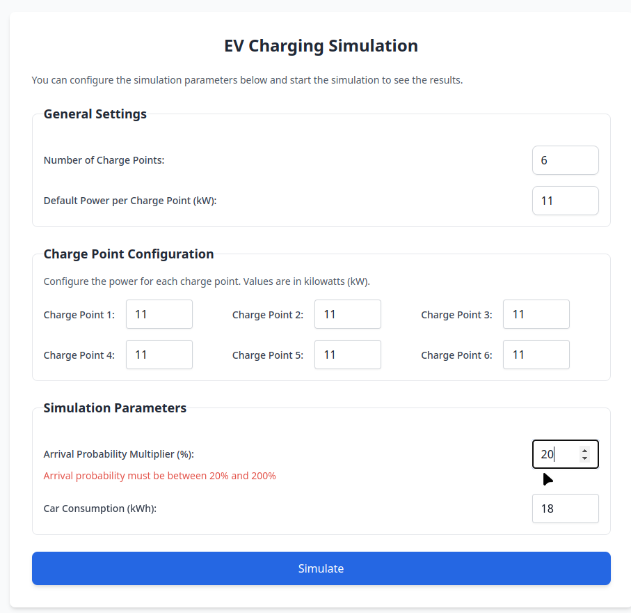
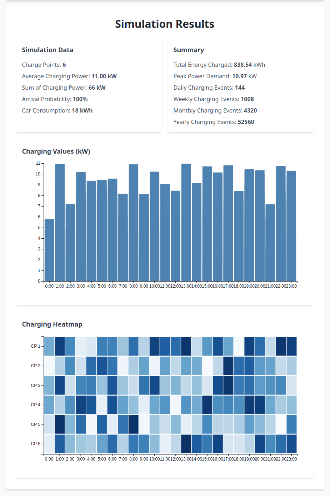
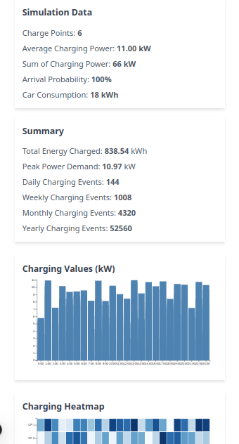
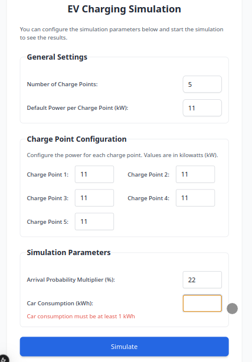

# EV Manager

A simple web application to simulate and manage electric vehicle (EV) charging stations.

---

## **Table of Contents**
- [Overview](#overview)
- [Live Demo](#live-demo)
- [Features](#features)
- [Screenshots](#screenshots)
- [Usage](#usage)
- [Output Results](#output-results)
- [Future Improvements](#future-improvements)
- [Technologies Used](#technologies-used)
- [Installation](#installation)
- [Project Structure](#project-structure)
- [Contributing](#contributing)
- [Authors](#authors)
- [Acknowledgements](#acknowledgements)
- [License](#license)


---

## **Overview**

Imagine you're a shopowner and you have a number of parking spaces (e.g. 200) available in front of your store for shoppers & employees. Now, because you see more and more EVs parking there every day, you're planning on building some chargepoints.
If you build 20 charging stations with a maximum charging speed of 11kW each, the theoretical maximum of total power demand is 220kW (a very high number that would be expensive to satisfy, e.g. requiring a new, more powerful grid connection). You know this is only a theoretical figure, because its statistically unlikely for all 20 charging stations to be charging at full power at the same time.
By simulating how electric chargers are actually used we can simulate how high the total energy consumption (kWh) is, what peak power loads (kW) occur, and how these figures change with the number of chargepoints installed.

This is where EV Manager comes in. It's a lightweight simulation tool that helps you calculate the total energy consumption of EV charging stations, analyze peak loads and daily charging events, and manage charging points efficiently.

- Calculate the total energy consumption of EV charging stations.
- Analyze peak loads and daily charging events.
- Manage charging points efficiently.

---

## **Live Demo**
Check out the live demo of the application:

[https://ev-manager.vercel.app](https://ev-manager.vercel.app/)

---

## **Features**
The application includes the following features:

- **Dynamic Input Form:** Add customizable parameters for charging stations.
- **Simulation Output:** Displays results like total energy consumption, peak load, and charging point usage.
- **Responsive Design:** Works seamlessly across devices.
- **Bar Chart Visualization:** Visual representation of hourly charging values.
- **Heatmap Visualization:** Visual representation of hourly charging heatmap.

## **Screenshots**

### Home Page
#### Simulation Form


#### Simulation Result


### Responsive Design


### Dynamic and Responsive Form


---

## **Usage**
### **Input Parameters**
1. Enter the following values in the input form:
   - **Number of Charge Points:** Number of charging stations.
   - **Default Charging Power:** Power rating of each charging station.
   - **Charge Point [Number]:** Power usage at each charging point.
   - **Arrival  probability:** The probability of a car arriving at the charging station.
   - **Car consumption:** The amount of energy consumed by a car.

2. Click the **Simulate** button to calculate results.

### **Output Results**
- **Total Energy Charged:** Total energy consumed by all charging stations.
- **Peak Power Demand:** Maximum power demand during the simulation.
- **Daily Charging Events:** Number of cars charged per day.
- **Weekly Charging Events:** Number of cars charged per week.
- **Monthly Charging Events:** Number of cars charged per month.
- **Yearly Charging Events:** Number of cars charged per year.
- **Bar Chart:** Hourly charging values for a charging station.
- **Heatmap:** Hourly charging heatmap for all charging stations.

---

## **Future Improvements**
Here are some ideas for improving the project:
- Chart improvements like tooltips, legends, and animations.
- Download simulation results as a CSV, PDF, or image.
- Add a **dark mode** feature.

---

## **Technologies Used**
The project is built using the following technologies:

- **React 19**: JavaScript library for building user interfaces.
- **Next.js 15**: React-based framework for server-side rendering.
- **Tailwind CSS**: For utility-first styling.
- **D3.js**: Data visualization library for creating interactive charts.
- **TypeScript**: Ensures type safety and scalability.
- **ESLint**: Linter for code quality and consistency.
- **CSS Variables**: Customizable theme with dynamic styling.

#### Todolist:
- **React Testing Library**: Testing framework for React components.
- **Cypress**: End-to-end testing framework for web applications.
- **Prettier**: Code formatter for consistent code style.
- **Husky**: Git hooks for running scripts before commits.
- **GitHub Actions**: CI/CD pipeline for automated testing and deployment.
- **Vercel**: Hosting platform for deploying Next.js applications.
- **Docker**: Containerization for building and running applications.

---

## **Installation**
To set up the project locally, follow these steps:

1. Clone the repository:
   ```bash
   git clone https://github.com/mirmousaviii/ev-manager.git
   cd ev-manager
   ```

2. Install dependencies:
   ```bash
    npm install
   ```

3. Start the development server:
   ```bash
    npm run dev
    ```

4. Open the browser and navigate to `http://localhost:3000`.


To build the project for production, run:

```bash
    npm run build
    npm run start
 ```

## **Project Structure**
The project is organized into the following directories:

---

```bash
src/
├── app/
│   ├── components/          # Reusable UI components
│   │   ├── SimulationForm/  # Input form for simulation parameters
│   │   ├── SimulationResult.tsx # Displays bar chart and heatmap
│   ├── styles/              # Global and component-specific styles
│   │   ├── globals.css      # Global Tailwind CSS configurations
│   ├── page.tsx             # Home page of the application
│   ├── layout.tsx           # Root layout for the application
├── types/                   # TypeScript type definitions
│   ├── index.ts             # Input and output data types
├── utils/                   # Utility functions for simulation
├── public/                  # Static assets (e.g., favicon, fonts)
```

---

## **Contributing**
Contributions are always welcome! 

Please adhere to the following guidelines:
- Fork the repository.
- Create a new branch (`git checkout -b feature`).
- Make changes and commit them (`git commit -am 'Add new feature'`).
- Push to the branch (`git push origin feature`).
- Create a new Pull Request.
- Feel free to open an issue if you have any questions or suggestions.
- Please ensure that your pull request is up-to-date with the `main` branch.
- Please ensure that your code passes the ESLint and Prettier checks.
- Please ensure that your code is well-documented and follows best practices.

---

## **Authors**
- Mostafa Mirmousavi [@mirmousaviii](https://github.com/mirmousaviii) [https://mirmousavi.com](https://mirmousavi.com)

---

## **Acknowledgements**
- [Reonic](https://reonic.com/)
- [TypeScript](https://www.typescriptlang.org/)
- [React](https://reactjs.org/)
- [Next.js](https://nextjs.org/)
- [Tailwind CSS](https://tailwindcss.com/)
- [D3.js](https://d3js.org/)
- [ESLint](https://eslint.org/) 

## **License**
This project is licensed under the MIT License. See the LICENSE file for details.

---

